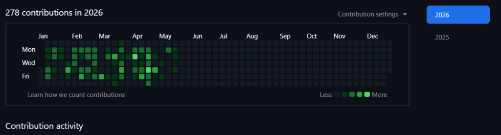
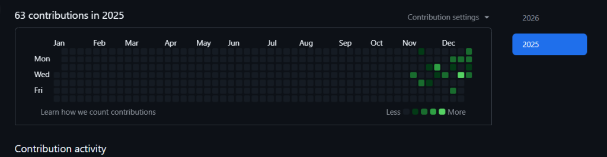

<h1 align="center">🚀 Rahul Kumar</h1>
<h3 align="center"><strong>Backend Software Engineer | Enterprise Java • Spring Boot • Node.js • Distributed Systems</strong></h3>

  

  
  
  
  

  <strong>💻 Building robust, scalable, and secure backend architectures with production-grade business logic.</strong>

---

<h2 align="center">🧑‍💻 Professional Summary</h2>

  ⚡ I am a backend-focused Software Engineer specializing in building scalable enterprise systems, transactional workflows, and distributed microservices. I design robust backend architectures, secure REST APIs, and automated data pipelines using <strong>Java / Spring Boot</strong> and <strong>Node.js</strong>.

  🛡️ Experienced in implementing enterprise-grade security (RBAC, JWT), event-driven microservices (Kafka), high-performance caching (Redis), and containerized deployments (Docker, CI/CD, Azure). Backed by a strong algorithmic foundation with <strong>600+ DSA problems solved</strong> in Java.

---

<h2 align="center">🛠️ Tech Stack & Ecosystem</h2>

  

  <table width="90%">
    <tr>
      <td valign="top" width="50%">
        <h3 align="center">💻 Programming & Backend</h3>
        <ul>
          <li>☕ <strong>Languages:</strong> Java (SE/EE), JavaScript (ES6+), SQL</li>
          <li>⚙️ <strong>Frameworks:</strong> Spring Boot, Spring Security, Express.js, Node.js</li>
          <li>🌐 <strong>Architecture:</strong> RESTful APIs, Microservices, Event-Driven Architecture</li>
        </ul>
      </td>
      <td valign="top" width="50%">
        <h3 align="center">⚙️ DevOps & Databases</h3>
        <ul>
          <li>🗄️ <strong>Databases:</strong> PostgreSQL, MySQL, MongoDB, Redis (Caching)</li>
          <li>🐳 <strong>Cloud & DevOps:</strong> Docker, Kubernetes (Basics), Azure, GitHub Actions</li>
          <li>🛠️ <strong>Tools:</strong> Nginx, Git/GitHub, Postman, JUnit, Maven</li>
        </ul>
      </td>
    </tr>
  </table>

---

<h2 align="center">💼 Professional Experience</h2>

<h3 align="center">🏢 <strong>Nexucon</strong> — <em>Associate Software Developer</em></h3>

<em>Enterprise Accounting & Financial Systems | Node.js • Express • PostgreSQL • Docker • Azure</em>

* ⚡ **Bulk Data Pipelines:** Engineered a robust, transactional Excel bulk upload pipeline featuring asynchronous parsing, schema validation, and preview-before-commit capabilities, drastically reducing incorrect database writes.
* 💸 **Financial Workflows:** Designed and implemented critical modules for an enterprise accounting suite, including Purchase Order (PO) management, Multi-Item Ledger transactions, and Bank Reconciliation matching logic.
* 🛡️ **Compliance & Taxation:** Programmed complex GST and HSN-based tax calculation engines supporting multi-tiered and multi-regional taxation rules.
* 🔐 **Security & Auth:** Configured secure API routes using Role-Based Access Control (RBAC) and JWT validation for distinct organizational profiles.
* 🐳 **Infrastructure & CI/CD:** Maintained Docker container deployments and collaborated on CI/CD workflows using GitHub Actions targetting Microsoft Azure.

---

<h2 align="center">🏢 Organizational Contribution Activity</h2>

Worked extensively on enterprise private repositories during professional experience (2025–2026).

  
  

  <em>💼 Contributions include enterprise backend development, accounting systems, invoice processing, GST workflows, RBAC systems, reconciliation modules, and production-grade REST APIs.</em>

---

<h2 align="center">🏆 Featured Projects</h2>

  <h3>🏥 CareVita — Multi-Tenant Healthcare Ecosystem</h3>
  
<em>Role-Based Medical Service Platform | Node.js • Express.js • MongoDB • Socket.io • Cloudinary</em>

* 🩺 **Core Engine:** Engineered a secure medical platform supporting RBAC (Admin, Doctor, Patient flows) and OTP-based authentication.
* 💬 **Real-time Comms:** Developed real-time clinic communication channels and doctor-patient chat using Socket.io.
* ☁️ **Secure Media:** Integrated secure Cloudinary media upload pipelines with server-side payload validation.

<a href="https://github.com/krahulsahu/carevita">🔗 View CareVita Repository</a>

 

  <h3>💳 Enterprise Financial & Bank Reconciliation Module</h3>
  
<em>Automated Reconciliation & Audit Trail | Java • Spring Boot • MySQL • Redis • Docker</em>

* 🔄 **Matching Algorithm:** Designed an automated reconciliation engine that matches bank statements against ledgers based on multi-parameter fuzzy logic.
* ⚡ **Performance Tuning:** Implemented Redis caching for high-frequency financial lookups, improving transaction verification speeds by 60%.
* 📝 **Audit Trail:** Built detailed audit logs and transaction history reporting utilizing event-driven updates.

 

  <h3>🎨 AI-Powered Image Synthesis Portal</h3>
  
<em>SaaS Platform with Credit-Based Billing | React.js • Node.js • Express.js • MongoDB • Redis</em>

* 🪙 **Rate Limiting & SaaS Flow:** Developed a full-stack dashboard utilizing text-to-image AI generations with built-in credit validation.
* ⚡ **Cache Management:** Used Redis to optimize API call rates and store active session states.

---

<h2 align="center">📈 Algorithmic & Coding Statistics</h2>

  🧠 <strong>DSA Mastery:</strong> Solved <strong>600+ problems</strong> across LeetCode and GeeksforGeeks using Java.

  <em>Proficient in Trees, Graphs, HashTables, Tries, Dynamic Programming, Greedy, and time/space complexity optimization.</em>

---

<h2 align="center">📊 GitHub Analytics & Technical Proficiency</h2>

  
  

<h3 align="center">🛠️ Language & Core Skill Index</h3>

   
   
   
   
   

---

<h2 align="center">💡 Developer Mindset</h2>

  <em>"I write backend systems engineered for durability, data integrity, and strict business compliance. Scalable architecture is not about avoiding complexity, but structuring it cleanly."</em>

